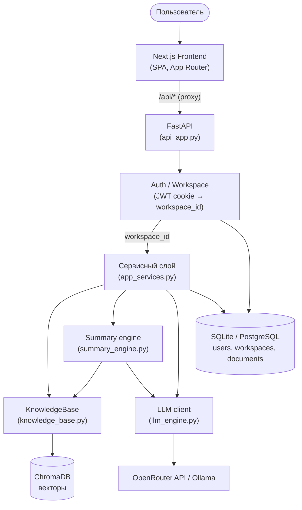
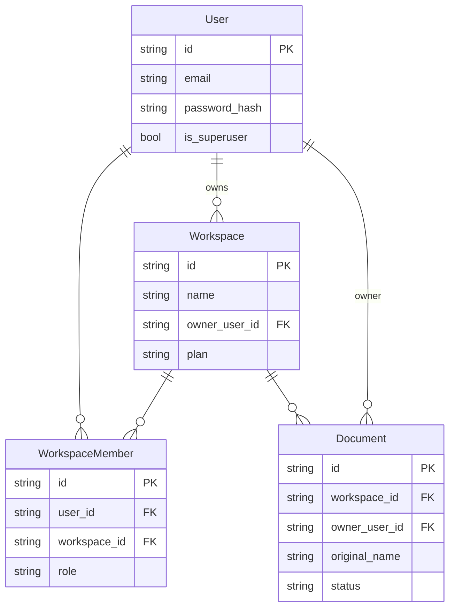

# Архитектура BonchMind Pro

Этот документ описывает, как устроен BonchMind Pro: компоненты, поток запроса, модель данных и модель изоляции пользователей. Для глубокого разбора multi-user слоя см. [`design/multi-user-architecture.md`](design/multi-user-architecture.md).

---

## Обзор

BonchMind Pro — multi-user RAG-платформа по загруженным учебным материалам. Каждый пользователь работает в своём изолированном рабочем пространстве (workspace): загружает документы, генерирует конспекты по теме и задаёт вопросы ассистенту, который отвечает с опорой на найденные фрагменты.

Система состоит из трёх процессов:

- **Frontend** — Next.js SPA, единственный пользовательский интерфейс.
- **Backend** — FastAPI: авторизация, сервисный слой, RAG-пайплайн.
- **База данных** — реляционная (SQLite в dev / PostgreSQL в Docker) + векторная (ChromaDB, файловая).

---

## Компоненты и поток запроса

### Жизненный цикл запроса

1. Браузер обращается к фронтенду; защищённые запросы идут на `/api/*` с `credentials: "include"`.
2. Next проксирует `/api/*` на backend (`BONCHMIND_API_URL`).
3. FastAPI извлекает пользователя из HttpOnly-cookie `bonchmind_auth` (JWT) и резолвит `workspace_id = current_user.personal_workspace.id`.
4. Роут вызывает сервисный слой (`app_services.py`), **всегда** передавая `workspace_id` явно.
5. Для поиска/конспекта `KnowledgeBase` фильтрует ChromaDB по `workspace_id`, делает semantic search (BGE-M3) + rerank (BGE-reranker), `summary_engine`/чат собирают промпт и зовут LLM (OpenRouter или Ollama).
6. Ответ с источниками возвращается на фронт.

---

## Модель данных

Каждый пользователь владеет своим персональным workspace (`Workspace.owner_user_id`); backend резолвит его как `current_user.personal_workspace`.

- `Document` — **источник правды по владению файлами**. Загрузка пишет строку с `workspace_id` + `owner_user_id`, а чанки в ChromaDB несут тот же `workspace_id` в metadata. Эти две стороны обязаны быть синхронны.
- Реляционные модели определены в `src/db_models.py`, схема управляется Alembic-миграциями (`alembic/versions/`).

---

## Модель изоляции (ключевой инвариант)

Изоляция данных между пользователями — центральный принцип проекта:

- **`workspace_id` берётся только из авторизации**, никогда из тела запроса или URL. Единственная точка — `api_app.get_current_workspace_id`, которая резолвит его из JWT-cookie.
- **`workspace_id` — обязательный keyword-only аргумент** во всех методах `knowledge_base.py` и `summary_engine.py`. Его отсутствие — это `TypeError` на уровне Python, а не тихий fallback (legacy `DEFAULT_WORKSPACE_ID` удалён в Stage 6).
- **Токен не хранится в браузере.** Auth только через HttpOnly-cookie; фронт никогда не пишет токен в `localStorage`/`sessionStorage`.
- **Тиры доступа** (в `api_app.py`):
  - Public: `/api/health`, `/api/auth/register`, `/api/auth/login`.
  - Authenticated: всё, что берёт зависимость `WorkspaceId`.
  - Superuser-only: `/api/diagnostics/*` и `/api/admin/*` (через `require_superuser`).

Итог: даже при ошибке в клиенте пользователь не может увидеть чужой workspace — backend подставляет его собственный из cookie.

**Hardening (Stage 9a):** rate limiting по IP на auth/chat/upload (`429`), защита от upload-DoS (ранний `413` без чтения файла в память), равное время ответа login для несуществующего email (anti-enumeration), и append-only audit-лог (`audit_events`) для `login`/`upload`/`delete`/`reindex`. Подробнее — раздел «Безопасность» в [`README.md`](README.md).

**Admin (Stage 9b):** суперпользователю доступен раздел «Админ» (`frontend/src/components/admin-workspace.tsx`) поверх двух read-only эндпоинтов — `GET /api/admin/stats` (счётчики инстанса) и `GET /api/admin/audit` (последние N событий аудита, newest-first). Оба за `require_superuser`; обычный пользователь не видит вкладку и получает `403` на прямой запрос. Назначение первого superuser — напрямую в БД (`users.is_superuser`), публичного API для этого нет. Подробнее — раздел «Администрирование» в [`README.md`](README.md).

---

## Где что лежит

| Концепция | Файл |
|-----------|------|
| FastAPI-роуты + auth-зависимости | `api_app.py` |
| Авторизация (JWT cookie, register/login/me/logout) | `src/auth_api.py`, `src/auth_service.py` |
| Сервисный слой (вызывается роутами) | `src/app_services.py` |
| RAG: поиск, индексация, workspace-фильтр | `src/knowledge_base.py` |
| Пайплайн конспектов | `src/summary_engine.py` |
| LLM-клиент (API или Ollama) | `src/llm_engine.py` |
| Pydantic-модели запросов/ответов | `src/api_models.py` |
| SQLAlchemy-модели | `src/db_models.py` |
| Alembic-миграции | `alembic/versions/` |
| Конфиг (env-driven) | `config.py` |
| Frontend shell + роутинг | `frontend/src/app/page.tsx`, `frontend/src/components/app-shell.tsx` |
| Frontend API-клиент + auth-хелперы | `frontend/src/lib/api.ts`, `frontend/src/lib/auth-context.tsx` |
| Экраны рабочих пространств | `frontend/src/components/{assistant,summary,materials,admin}-workspace.tsx` |

---

## Технологический стек

| Слой | Технологии |
|------|-----------|
| Frontend | Next.js 16, React 19, TypeScript, Tailwind CSS v4 |
| Backend | Python, FastAPI, SQLAlchemy, Alembic |
| Реляционная БД | SQLite (dev) / PostgreSQL (Docker/prod) |
| Векторная БД | ChromaDB (файловая) |
| Эмбеддинги | BAAI/bge-m3 |
| Реранкер | BAAI/bge-reranker-v2-m3 (cross-encoder) |
| LLM | OpenRouter API (по умолчанию) или локальная Ollama |
| Деплой | Docker + docker-compose |
| CI | GitHub Actions (backend-тесты, alembic-проверка, frontend typecheck/lint, compose-config) |

---

## Хранение данных

| Что | Где (dev) | Где (Docker) |
|-----|-----------|--------------|
| Пользователи, workspace, документы | SQLite `data/app.db` | Postgres (том `pgdata`) |
| Векторы (чанки + metadata) | `data/chromadb/` | том `data` |
| Загруженные файлы | `docs/` | том `docs` |
| Кэш моделей BGE | HF cache | том `models` |

ChromaDB остаётся файловой и при переходе на Postgres — Postgres заменяет только реляционную БД. Перенос векторов в pgvector — пункт roadmap, не реализован.
